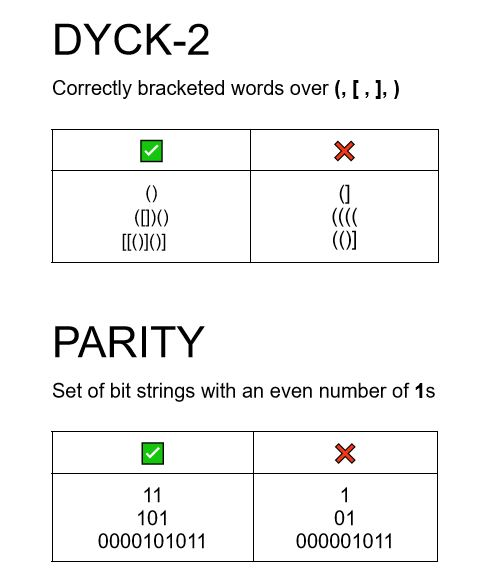

# AFLT Project-Dyck Self-Attention

Project of the course Advanced Formal Language Theory offered in Spring 2022 (263-5352-00L). We seek to evaluate various solutions to overcoming the theoretical limitations of self-attention with respect to the hierarchical language Dyck.

The theoretical limitations are discussed in [Hahn](https://arxiv.org/abs/1906.06755), while we attempted to adapt solutions proposed in [Chiang et al.](https://arxiv.org/abs/2202.12172).

The code is built upon/inspired by various existing implementations:
- [Parity Implementation](https://github.com/ndnlp/parity)
- [Transformer Implementation](https://github.com/satwik77/Transformer-Formal-Languages)

Since Chiang et al. only applied their improvements for PARITY, we tried to adapt them for DYCK-2 in this project.

## TODO: Visuals
The DYCK-2 and PARITY languages are defined as follows. (Visualization adapted from [Hahn](https://stanford.edu/~mhahn2/cgi-bin/files/acl2020-selfattention.pdf ))

As we can see from letting a 2 head, 2 layer network trying to recognise long DYCK-2 sequences (200 token) does not converge to a good accuracy or cross entropy, different 
from recognizing shorter sequences (10 token), where fast convergence can be observed.

## TODO: Installation
Within a particular ecosystem, there may be a common way of installing things, such as using Yarn, NuGet, or Homebrew. However, consider the possibility that whoever is reading your README is a novice and would like more guidance. Listing specific steps helps remove ambiguity and gets people to using your project as quickly as possible. If it only runs in a specific context like a particular programming language version or operating system or has dependencies that have to be installed manually, also add a Requirements subsection.

## TODO: Usage
Use examples liberally, and show the expected output if you can. It's helpful to have inline the smallest example of usage that you can demonstrate, while providing links to more sophisticated examples if they are too long to reasonably include in the README.

## TODO: Support
Tell people where they can go to for help. It can be any combination of an issue tracker, a chat room, an email address, etc.

## TODO: Contributing
State if you are open to contributions and what your requirements are for accepting them.

For people who want to make changes to your project, it's helpful to have some documentation on how to get started. Perhaps there is a script that they should run or some environment variables that they need to set. Make these steps explicit. These instructions could also be useful to your future self.

You can also document commands to lint the code or run tests. These steps help to ensure high code quality and reduce the likelihood that the changes inadvertently break something. Having instructions for running tests is especially helpful if it requires external setup, such as starting a Selenium server for testing in a browser.

## TODO: Authors and acknowledgment
Show your appreciation to those who have contributed to the project.

## TODO: License
For open source projects, say how it is licensed.

