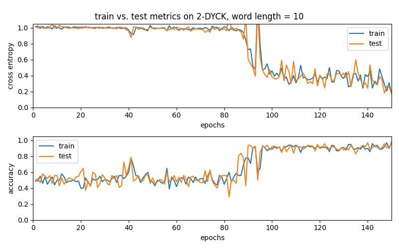

# AFLT Project-Dyck Self-Attention

Project of the course Advanced Formal Language Theory offered in Spring 2022 (263-5352-00L). We seek to evaluate various solutions to overcoming the theoretical limitations of self-attention with respect to the hierarchical language Dyck.

The theoretical limitations are discussed in [Hahn](https://arxiv.org/abs/1906.06755), while we attempted to adapt solutions proposed in [Chiang et al.](https://arxiv.org/abs/2202.12172).

The code is built upon/inspired by various existing implementations:
- [Parity Implementation](https://github.com/ndnlp/parity)
- [Transformer Implementation](https://github.com/satwik77/Transformer-Formal-Languages)

Since Chiang et al. only applied their improvements for PARITY, we tried to adapt them for DYCK-2 in this project.

## Visuals
The DYCK-2 and PARITY languages are defined as follows (Visualization adapted from [Slides](https://stanford.edu/~mhahn2/cgi-bin/files/acl2020-selfattention.pdf ) provided by Hahn):


As we can see a 2 head, 2 layer network trying to recognise long DYCK-2 sequences (100 token) does not converge to a good accuracy or cross entropy. Different 
from recognizing shorter sequences (10 token) with the same network, where fast convergence can be observed.




## Installation
Install the provided requirements by executing 
```
pip install -r requirements.txt
```


## Usage
### Base Line Experiments
Reproduce the base line experiment on 2-Dyck by executing
```
cd src
python base_experiment.py
```
There are different versions of this file for running experiments with 2-Dyck hard attention (`base_hard.py`), 1-Dyck soft attention (`base_1dyck.py`) and (1,2)-Dyck with soft attention (`base_1Ddyck.py`).

Precomputed results for these experiments can be found in the folders `results/` (2-Dyck soft attention), `resultsHard/`(2-Dyck hard attention), `results1dyck/` (1-Dyck soft attention), and `results1DDyck/` ((1,2)-Dyck soft attention).

### Recognize DYCK Language
Generate Dyck examples and train a model by executing
```
cd src
python dyck_reproduce.py
```
| argument       | type  | default | explanation                                                                                        |
|----------------|-------|---------|----------------------------------------------------------------------------------------------------|
| --train_length | int   | 100     | Length of the string given for training                                                            |
| --test_length  | int   | 100     | Length of the string given for testing                                                             |
| --p_val         | float | 0.5     | Probability for a new opening bracket instead of closing the upcoming bracket when generating Dyck |
| --q_val         | float | 0.5     | Probability for not changing one character in the Dyck-word when generating it                     |
| --num_par        | int   | 1       | the number of pairs N of N-Dyck  |
| --depth        | int   | -1       | the depth D of Dyck-(N, D). (Default -1 means N-Dyck is used) |
| --shuffle        | bool   | False       | If True, then Shuffle-Dyck is produced                                                  |
| --epochs       | int   | 100     | Number of epochs                                                                                   |
| --steps        | int   | 100     | Number of different steps for training and testing                                                 |

Model Parameters

| argument  | type  | default | explanation                                                                   |
|-----------|-------|---------|-------------------------------------------------------------------------------|
| --layers  | int   | 2       | Number of layers in the Transformer                                           |
| --heads   | int   | 2       | Number of heads in the Transformer                                            |
| --d_model | int   | 16      | Dimension of the model                                                        |
| --d_ffnn  | int   | 64      | Dimension of the Feedforward Neural Network                                   |
| --hard    | bool  | False   | If set to true, use hard attention instead of soft attention                  |
| --scaled  | bool  | False   | Log-length scaled attention (only works if hard attention is not set to true) |
| --eps     | float | 1e-5    | Value added to denominator in layer normalization                             |

### Improved N-Dyck recognition
Generate Dyck examples and train the improved model on N-dyck by executing
```
cd src
python dyck_exact.py
```

| argument       | type  | default | explanation                                                                                        |
|----------------|-------|---------|----------------------------------------------------------------------------------------------------|
| --train_length | int   | 100     | Length of the string given for training                                                            |
| --test_length  | int   | 100     | Length of the string given for testing                                                             |
| --p_val        | float | 0.5     | Probability for a new opening bracket instead of closing the upcoming bracket when generating Dyck |
| --q_val        | float | 0.5     | Probability for not changing one character in the Dyck-word when generating it                     |
| --num_par      | int   | 1       | the number of pairs N of N-Dyck                                                                    |
| --depth        | int   | -1      | the depth D of Dyck-(N, D). (Default -1 means N-Dyck is used)                                      |
| --shuffle      | bool  | False   | If True, then Shuffle-Dyck is produced                                                             |
| --epochs       | int   | 100     | Number of epochs                                                                                   |
| --steps        | int   | 100     | Number of different steps for training and testing                                                 |
| --perturb      | float | 0       | randomly perturb parameters                                                                        |
| --train        | -     | False   | If given, model is trained before evaluation                                                       |
| --hard         | bool  | False   | If set to true, use hard attention instead of soft attention                                       |

Similarly, you can run the improved model with layer normalization using
```
cd src
python dyck_exact_layernorm.py
```

which has the same arguments as without layer normalization, and one addtional argument

| argument | type  | default | explanation                                       |
|----------|-------|---------|---------------------------------------------------|
| --eps    | float | 1e-5    | Value added to denominator in layer normalization |

### Reproducting base experiments
To run the base experiments on the improved version of the transformer, run 
```
cd src
python improved_1dyck.py
```
This runs the same experiment as in `base_1dyck.py` but with the improved transformer and <mark>without training</mark>.
Similarly, you can run the base experiments for 1-Dyck with layer normalization (`improved_1dyck_ln.py`) and for (1,2)-Dyck without (`improved_1Ddyck.py`) and with layer normalization (`improved_1Ddyck_ln.py`).

Precomputed results can be found in the corresponding results folders (`resultsImpr1Dyck/`, `resultsImpr1DyckLN/`, `resultsImpr13Dyck/`, `resultsImpr13DyckLN/`).

To run the improved experiment with (1,3)-Dyck <mark>with training</mark>, run 
```
cd src
python improved_1Ddyck_train.py
```
These results can be plotted with `plot_improved.py`

### Improved (1,D)-Dyck recognition
Generate Dyck examples and train the improved model on (1,D)-dyck by executing
```
cd src
python dyck1d_exact.py
```
and with layer normalization 
```
cd src
python dyck1d_exact_layernorm.py
```

The arguments are the same as in the `dyck_exact` versions.

### Create Plots From Results
You can create plots of train and test metrics for different word lengths by executing the corresponding script for the base experiments:
```
cd src
python plot_results.py
```
When your results are not stored under `results/`, change the folder name in the file `plot_results.py`.

## TODO: Support
Tell people where they can go to for help. It can be any combination of an issue tracker, a chat room, an email address, etc.

## TODO: Contributing
State if you are open to contributions and what your requirements are for accepting them.

For people who want to make changes to your project, it's helpful to have some documentation on how to get started. Perhaps there is a script that they should run or some environment variables that they need to set. Make these steps explicit. These instructions could also be useful to your future self.

You can also document commands to lint the code or run tests. These steps help to ensure high code quality and reduce the likelihood that the changes inadvertently break something. Having instructions for running tests is especially helpful if it requires external setup, such as starting a Selenium server for testing in a browser.

## TODO: Authors and acknowledgment
Show your appreciation to those who have contributed to the project.

## TODO: License
For open source projects, say how it is licensed.

